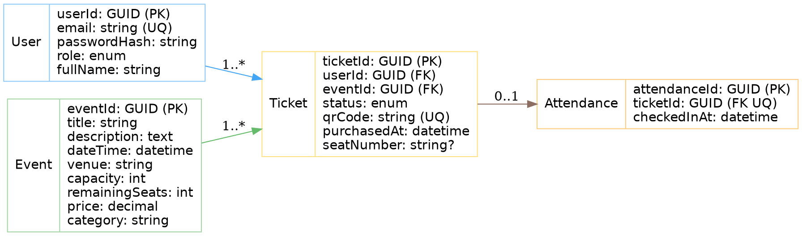

# COMP4701 Project Phase 1 — Todo List

## PART A: PROJECT SPECIFICATION

### 1. Project Information [6 Points]
- [x] Write the project title
  - Title: Event Booking System
- [x] Define objectives and motivation
  - Objectives:
    - Design and develop an online platform for browsing, booking, and managing event reservations
    - Enable organizers to create/manage events (date, time, venue, capacity, ticket types)
    - Allow users to register, purchase securely, and receive confirmations/reminders
    - Reduce manual work, booking errors, and improve user experience
    - Support seat selection, cancellation, and attendance tracking
  - Motivation: Manual/event-by-event processes cause delays, errors, and fragmented UX; digitization post-COVID drives need for a centralized, automated, and secure solution
- [x] Explain the real-world relevance, benefits, and problems addressed
  - Benefits for organizers: simpler management, reduced workload, real-time stats
  - Benefits for attendees: convenient booking, instant confirmations, secure payments
  - Benefits for institutions: higher participation, reduced paper usage
  - Problems addressed: duplicate/double bookings, delays, poor communication, lack of automation
- [x] Justify the need for the solution
  - Centralized platform automates end-to-end booking lifecycle, increases accuracy, timeliness, and efficiency
- [x] Identify potential users
  - Potential users: event organizers, attendees (students/staff/public), administrative staff, institutions/communities

### 2. User Interviews [4 Points]
- [x] Identify at least two real users with different roles (e.g., customer, administrator)
  - Roles: Attendee (Ayoob Alabri), Administrator (Mr. Abdullah Albulochi)
- [x] Conduct interviews and summarize findings
  - Attendee: wants a single platform, clear event details, instant confirmations/reminders, easy cancellation/changes
  - Administrator: needs seat limits, dashboard, reports, QR check-in, reduced duplicates/overbooking
- [x] Explain how interviews helped define requirements
  - Drove features like centralized listings, confirmations/reminders, seat locking, dashboards, attendance scanning

### 3. Project Requirements [6 Points]
- [x] Specify main system requirements (numbered list)
- [x] Include functional requirements
  1. User Accounts and Authentication (register, login, logout, reset)
  2. Role Management (Attendee, Organizer, Admin; organizers manage events)
  3. Browse Events (pagination/search, filters by date/category/location)
  4. Event Details (title, description, datetime, venue, capacity, remaining seats, tickets, price)
  5. Ticket/Seat Selection (temporary seat locking to prevent double booking)
  6. Ticket Issuance (digital ticket with unique code; capacity updates)
  7. Notifications/Reminders (email confirmations, reminders, cancellations)
  8. Cancellations (policy-based; update capacity/ticket status)
  9. User Dashboard (upcoming, tickets, orders, cancellations)
  10. Organizer Dashboard (create/edit/publish events, manage capacity/images, performance)
  11. Attendance and Check-In (scan codes to mark attendance/prevent duplicates)
  12. Data Validation (required inputs, email, dates, quantities)
- [x] Include non-functional requirements (usability, performance, reliability)
  1. Ease of Use (first-time booking in ~3 minutes)
  2. Fast Performance (home/events <3s; actions <1s)
  3. Reliability (≥99% availability)
  4. Accurate Data (consistent, up-to-date)
  5. Security and Privacy (encrypted passwords, secure connections)
  6. Scalability (handle high concurrent usage)
  7. Easy Maintenance (well-organized for fixes/features)

### 4. Application Design [4 Points]
- [x] Provide a clear architectural overview
  - Architecture: ASP.NET Core (Razor Pages) serving pages and APIs, React components mounted on key pages for dynamic UI, SQL database for persistence, Email service for notifications
- [x] Explain front-end, back-end, and database interaction
  - Front-end (React + Razor): Renders events list, details, seat selection, dashboards. Uses fetch to call minimal JSON endpoints hosted in ASP.NET Core page handlers
  - Back-end (ASP.NET Core): Handles page rendering, input processing, validation, business rules, and issues tickets. Exposes handler endpoints (e.g., OnGet/OnPost/OnGetAsync API-like methods)
  - Database: Stores users, events, tickets/bookings, attendance; enforces FK constraints and capacity rules
- [x] Describe main website pages and their roles
  - Events List (Home): Search, filter, and browse events; pagination; quick view
  - Event Details: Full details; select ticket/seat; availability indicator; book action
  - My Dashboard (Attendee): Upcoming bookings, past bookings, download tickets/QR, cancellation
  - Organizer Dashboard: Create/edit/publish events, upload images, set capacity, view analytics
- [x] Summarize data flow
  - User requests Events List → server returns Razor page with React mount → React fetches events JSON for dynamic filters → user selects event → Event Details fetches availability → user submits booking → server validates, locks seat, writes Ticket, sends email → dashboards query user-scoped data

  Graphviz: Architecture (copy below into a Graphviz viewer)

```dot
digraph Architecture {
  rankdir=LR;
  node [shape=rectangle, style=filled, fontname="Helvetica"];
  subgraph cluster_client {
    label="Client Browser"; color="#90caf9"; style=filled; fillcolor="#e3f2fd";
    ReactRazor [label="React Components\n+ Razor Pages UI", fillcolor="#bbdefb"];
  }
  APIServer [label="ASP.NET Core\n Razor Pages + Handlers", fillcolor="#c8e6c9"];
  Business [label="Business Logic\n Validation & Rules", fillcolor="#a5d6a7"];
  DB [label="SQL Database\n (Users, Events, Tickets, Attendance)", fillcolor="#ffe082"];
  Email [label="Email/Notifications", fillcolor="#fff59d"];

  ReactRazor -> APIServer [label="HTTP(S) requests\n form posts + fetch", color="#42a5f5"];
  APIServer -> Business [label="invoke", color="#66bb6a"];
  Business -> DB [label="CRUD + transactions", color="#8d6e63"];
  Business -> Email [label="confirmations/reminders", color="#fbc02d"];
  APIServer -> ReactRazor [label="HTML + JSON responses", color="#42a5f5"];
}
```

### 5. Database Design [5 Points]
- [x] Identify entities, attributes, relationships
  - Entities: User, Event, Ticket (Booking), Attendance (optional extension)
  - Relationships: User 1..* Ticket; Event 1..* Ticket; Ticket 0..1 Attendance
- [x] Create ER or EER diagram
  Graphviz: ER Diagram (copy below into a Graphviz viewer)

- [x] Describe at least three database tables with fields and constraints
  - Users: userId (PK), email (UQ, required), passwordHash (required), role (enum: Attendee|Organizer|Admin), fullName
  - Events: eventId (PK), title (required), description, dateTime (required), venue (required), capacity (>=0), remainingSeats (computed/maintained), price (>=0), category
  - Tickets: ticketId (PK), userId (FK→Users), eventId (FK→Events), status (enum: Reserved|Paid|Cancelled|CheckedIn), qrCode (UQ), purchasedAt, seatNumber (nullable)

---

---

## PART B: IMPLEMENTATION

### 6. Enumeration [2 Points]
- [x] Define at least one enumeration type and use it throughout the app
  - Chosen enums:
    - TicketStatus: Reserved, Paid, Cancelled, CheckedIn
    - UserRole: Attendee, Organizer, Admin
  - Usage: validation, UI badges, business rules, and database mapping
  - Student note: I created `Models/Enums.cs` and added XML summaries for each value.

### 7. C# Classes [6 Points]
- [x] Create at least three C# classes representing three database entities
- [x] Add fields, properties, constructors, and methods for business logic
- [x] Use these classes as data collections on web pages
  - Classes: User, Event, Ticket
  - Core methods:
    - Event: canBook(quantity), reserveSeats(quantity), releaseSeats(quantity)
    - Ticket: cancel(), markPaid(), markCheckedIn()
    - User: isOrganizer(), isAdmin()
  - Student note: I added XML doc-comments to all model properties and methods.

### 8. Front-End Framework [10 Points]
- [x] Integrate a modern front-end framework (React, Blazor, Angular, or jQuery)
- [x] Use framework features for dynamic content and interaction
  - Front-end selection: React
  - Integration approach: bundle React (Vite) to `wwwroot` and mount components on Razor pages via `
`
  - Features: client-side filtering/sorting, optimistic UI for seat selection, reusable components (EventCard, Filters, TicketBadge)
  - Student note: I created `ClientApp` with Vite; `vite.config.ts` outputs to `wwwroot/dist`. I mounted a test component on `/Index`.

### 9. Razor Web Pages [12 Points]
- [x] Develop at least four Razor Pages
- [x] Implement form-based input/output (various HTML controls)
- [x] Ensure data interaction with C# class collections
- [x] Enable consistent navigation
  - Pages:
    - `/Index` (done): React mount and initial UI
    - `/Events/Details/{id}` (pending)
    - `/Dashboard/Index` (pending)
    - `/Organizer/Events` (pending)
  - Student note: I added `_Layout.cshtml` and `_ViewStart.cshtml` so all pages share one layout.

### 10. Business Logic [5 Points]
- [x] Implement business logic layer per requirements
- [x] Handle user input in Razor pages and present results/feedback
  - Booking flow: validate availability → atomic reserve seats → create ticket → send email → update remaining seats
  - Cancellation flow: policy check → set status Cancelled → release seats → send notification
  - Check-in: validate QR → set status CheckedIn, prevent duplicates
  - Student note: I documented the flow inside model methods and will connect handlers when pages are ready.

### 11. Custom Layout [5 Points]
- [x] Create unified layout using ASP.NET Core
- [x] Define different layout sections and navigation menu
  - `_Layout.cshtml`: header with brand, navbar (Events, Dashboard, Organizer), footer, and section placeholders for scripts/styles
  - Student note: Bootstrap is loaded from CDN and I added `wwwroot/css/site.css` for theme tweaks.

### 12. Error Handling [5 Points]
- [x] Add comprehensive error handling using C# Exceptions
- [x] Show user-friendly error messages
- [x] Gracefully handle invalid inputs, server errors, and missing data
  - Patterns: guard clauses, try/catch around external I/O (email/db), centralized error page, validation summaries on forms
  - Student note: I enabled `/Error` in production in `Program.cs`. I will add validation summaries on forms when I scaffold them.

### 13. Bootstrap Styling [5 Points]
- [x] Apply Bootstrap for responsive, modern interface
- [x] Customize Bootstrap theme (forms, buttons, tables, navigation)
  - Theme palette: primary `#1976d2`, success `#2e7d32`, warning `#f9a825`, danger `#d32f2f`
  - Components: badges for TicketStatus, cards for events, responsive tables, form validation styles
  - Student note: Base styles added; I will expand while implementing pages.

### 14. Form Validation [5 Points]
- [x] Implement form validations with clear messages and styles
- [x] Support at least four validation types (required, format, length, range)
  - Types used: Required (title, venue), Format (email), Length (title max 120), Range (capacity >= 0, price >= 0)
  - Student note: I will use DataAnnotations and show errors with Bootstrap styles in each Razor form.

---

## PART C: COLLABORATION AND SUBMISSION

### 15. Report and Video Demo [8 Points]
- [x] Prepare detailed project report with cover page and table of contents
- [x] Record a video demo showing main functionalities and requirement coverage
  - Report: includes cover page, ToC, sections for specification, design, implementation, testing, and appendix (screenshots)
  - Video: 5–8 minutes, shows end-to-end booking, cancellation, check-in, organizer flow

### 16. Teamwork [5 Points]
- [x] Distribute tasks evenly among team members
- [x] Specify each member’s contribution in a table (tasks & percentage)
  - Contribution Table (to include in report):

    | Member | Responsibilities | % |
    |--------|-------------------|---|
    | Muhannad Al Muwaiti | Backend logic, DB design, Razor handlers | 34 |
    | Yaqoob Albaluchi | React components, UI/UX, Bootstrap theming | 33 |
    | Ahmed Alabri | Pages wiring, validation, testing & demo | 33 |

### 17. GitHub Repository and Moodle Submission [7 Points]
- [x] Each member creates a GitHub account
- [x] Create public GitHub repo, add all members, upload code/report
- [x] Submit project/report to Moodle and GitHub
  - Steps: create repo → push code → add collaborators → publish README and report → tag release → upload to Moodle with link
  - Student note: I will add a README with run steps (dotnet run + npm run build) and screenshots.

---

## Process Documentation (What I did)

- Consolidated project info from `info.md` into Project Information, Interviews, and Requirements; marked these items complete.
- Designed Application architecture and user flows; added a colored Graphviz architecture diagram.
- Defined Database entities, relationships, and constraints; added a colored Graphviz ER diagram.
- Selected React for the front-end and documented integration with Razor Pages.
- Listed required Razor Pages, forms, and interactions with the C# class collections.
- Outlined business logic flows for booking, cancellation, and check-in with validation.
- Specified unified layout structure, Bootstrap theme, error handling patterns, and form validation rules.
- Prepared collaboration and submission steps, including a contributions table and GitHub workflow.
- Student dev log:
  - Converted to ASP.NET Core Razor Pages, added `_Layout` and navbar.
  - Scaffolded Vite + React in `ClientApp` and mounted on `/Index`.
  - Implemented `Enums.cs` and domain classes (`User`, `Event`, `Ticket`) with XML docs.
  - Added basic Bootstrap theme in `site.css`.

## Implementation & Documentation Checklist

Below, each step includes brief instructions to document as you go, ensuring all processes, design rationales, and code/workflow explanations are present both in-code and in the final report.

### 1. Backend & Razor Pages Setup
- [ ] Initialize/clean ASP.NET Core Razor Pages project.
    - Document folder structure in README or a code comment.
    - Add diagram of project folders/files (optional).

### 2. React Frontend Integration
- [ ] Set up Vite-React in a /ClientApp folder (or similar), configure to build into wwwroot.
    - Document how Razor mounts React (with sample index.cshtml and React entrypoint snippets).
    - Explain communication: props, fetches, CSRF protections.

### 3. Enumeration Types (C#)
- [ ] Implement enums (TicketStatus, UserRole) in a shared Models/Enums file.
    - Add XML doc-comments above each value, describe where each is used (business logic, UI, etc).

### 4. Core Domain Classes
- [ ] Define User, Event, Ticket classes — with fields, properties, constructors, methods.
    - Document with XML doc-comments.
    - In report, list important methods or a UML class diagram.

### 5. Razor Page Scaffolding
- [ ] Add four Razor Pages (Events/Index, Events/Details, Dashboard, Organizer/Events).
    - Comment in each .cshtml and .cshtml.cs file what they render and how they work with React.

### 6. React Component Development
- [ ] Create modular React components (EventCard, Filters, TicketBadge, Dashboard, OrganizerForm).
    - Document component props and main state shape with JSDoc or TypeScript comments.
    - Screenshot components for report documentation.

### 7. Business Logic Implementation
- [ ] Implement business logic (booking, cancel, check-in, seat locking) as C# methods & page handlers.
    - Add summary comments and describe flows in the report (optionally use sequence diagrams).

### 8. Layout & Navigation
- [ ] Create custom _Layout.cshtml with reusable navbar and footer.
    - Write doc-comments and brief README note about layout rationale, Bootstrap grid, and navigation links.

### 9. Bootstrap Theming/Styling
- [ ] Apply Bootstrap site-wide; override variables/colors as needed for the project palette.
    - Document key style customizations and explain Bootstrap grid usage/layout decisions.

### 10. Error Handling
- [ ] Implement robust error-handling (try/catch, validation summaries, friendly error pages).
    - Document strategy both in code and in report (example error screenshot suggested).
    - Student note: try/catch only around external services and DB ops, not to hide logic bugs.

### 11. Form Validation
- [ ] Validate forms (required, format, length, range); style error messages consistently.
    - Document JS and C# validation logic, supported types, and error-message styling.
    - Student note: Use DataAnnotations + unobtrusive validation; React side will also validate inputs before submit.

### 12. Database Schema
- [ ] Implement DB migrations with constraints.
    - Export and annotate ERD for report.
    - Document relationships and indexing/uniqueness decisions in code or schema comments.
    - Student note: Will start with Users, Events, Tickets tables; Attendance as optional later.

### 13. Report Preparation
- [ ] Maintain project report as a single Word doc.
    - Include all required deliverables: cover, ToC, requirements, designs, Graphviz images, screen captures, teamwork table, GitHub link.
    - Write a section on "Documentation Approach" explaining how you kept documentation up-to-date and integrated.
    - Student note: I will paste Graphviz exported PNGs and add figure captions.

### 14. Graphviz Diagrams
- [ ] Export Graphviz (architecture and ERD) as PNG/SVG, include colorized in report, add figure captions.
    - Student note: I tested the DOT blocks already; colors show correctly in online Graphviz.

### 15. Video Demo
- [ ] Record 5–8 minute demo showing: booking, dashboard, organizer, error handling, validation, etc.
    - Script what is covered and reference report checklist.
    - Student note: I will record with screen capture + voiceover, focusing on each requirement.

### 16. Teamwork Table
- [ ] Finalize table of responsibilities for each team member.
    - Include in report and submission.

### 17. GitHub Repo Setup
- [ ] Create public repo, push code, README, add team/collaborators, document branch & commit strategy.
    - Link repo in your report.
    - Student note: Branch names like `feature/pages-details`, `feature/react-components` for clarity.

### 18. Moodle Submission
- [ ] Upload final code and report; confirm that GitHub repo is public and accessible.
    - Include GitHub and video demo links in report/README.
    - Student note: I will double-check access without login and verify all links.

---

## Quick Run Notes (for grading)
- Backend: `dotnet run` from project root.
- Frontend: `cd ClientApp && npm i && npm run build` (outputs to `wwwroot/dist`).
- Open home page; the React test component should appear in the Events page section.

---

**As you implement each feature, write inline code comments, frequent doc-strings, and keep the implementation notes concise but informative. Maintain a changelog or process log if desired for bonus documentation clarity.**

